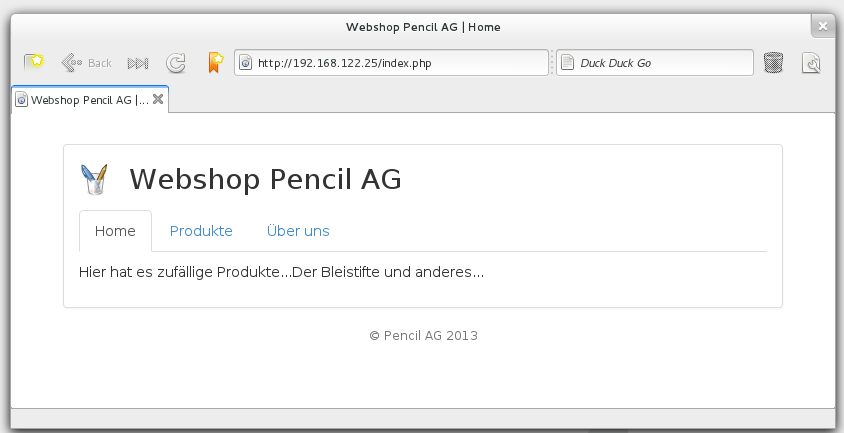

.. 

Style and design
================

Cascading Style Sheets
----------------------
The design of the shop will be nothing fancy. The approach which was choosen
will reflect the points mentioned in the :ref:`design-principles` section and 
makes heavy use of the `bootstrap`_ framework cascading style sheet. Various 
changes to this CSS file ensure that it matche the needs of this project.

.. _bootstrap: http://getbootstrap.com/
.. _CSS validator: http://jigsaw.w3.org/css-validator/

Pages
-----
The product page show the elements mentioned in the :ref:`basic-product-overview`
section.
