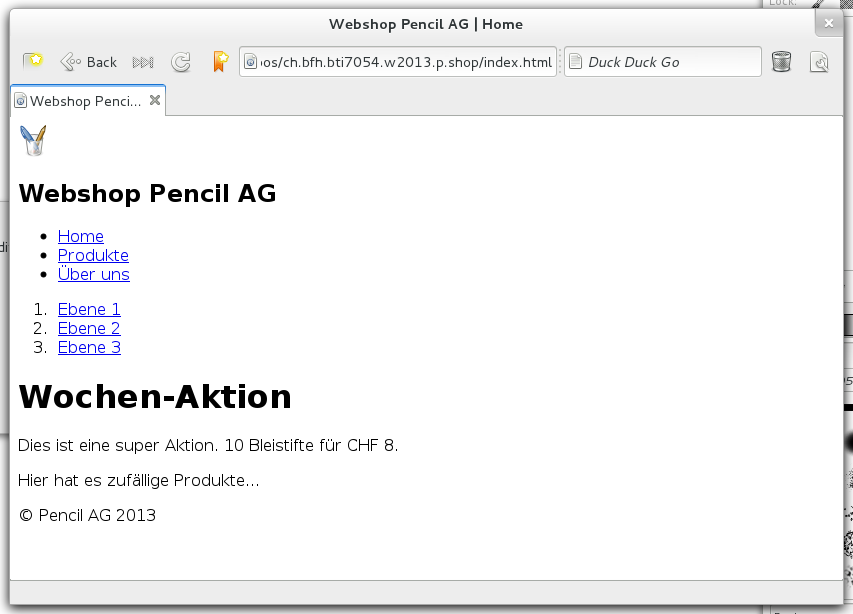

.. 

Haupt-Seite
===========

Der erste Entwurf der Hauptseite basiert auf dem Prototyp, gezeigt in Abschnitt
:ref:`layout`, ohne Format- und Stil-Informationen. ::

    <!DOCTYPE html>
    <html lang="en">
        <head>
            <meta charset="utf-8">
            <meta name="viewport" content="width=device-width, initial-scale=1.0">
            <meta name="description" content="Webshop Pencil AG für Bleistifte">
            <meta name="author" content="Fabian Affolter">
            <title>Webshop Pencil AG | Home</title>
        </head>

        <body>
            <!-- Header container-->
            

                

                  <!-- Logo and company name -->
                  
                  <h2>Webshop Pencil AG</h2>
                  <!-- Navigation -->
                  <ul>
                      <li><a href="#">Home</a></li>
                      <li><a href="#">Produkte</a></li>
                      <li><a href="#">Über uns</a></li>
                  </ul>
                  <!-- Breadcrumb -->
                  <ol>
                      <li><a href="#">Ebene 1</a></li>
                      <li><a href="#">Ebene 2</a></li>
                      <li><a href="#">Ebene 3</a></li>
                  </ol>
                

            

            <!-- Header container-->

            <!-- Action container -->
            

                <h1>Wochen-Aktion</h1>
                
Dies ist eine super Aktion. 10 Bleistifte für CHF 8.

            

            <!-- Action container -->

            <!-- Selected products -->
            

                
Hier hat es zufällige Produkte...

            

            <!-- Selected products -->

            <!-- Footer -->
            

                
&copy; Pencil AG 2013

            <!-- Footer -->
            

        </body>
    </html>

In einem Browser dargestellt, sieht die Seite wie in nachfolgend gezeigten 
:ref:`Screenshot <main1>` aus.

.. _main1:

