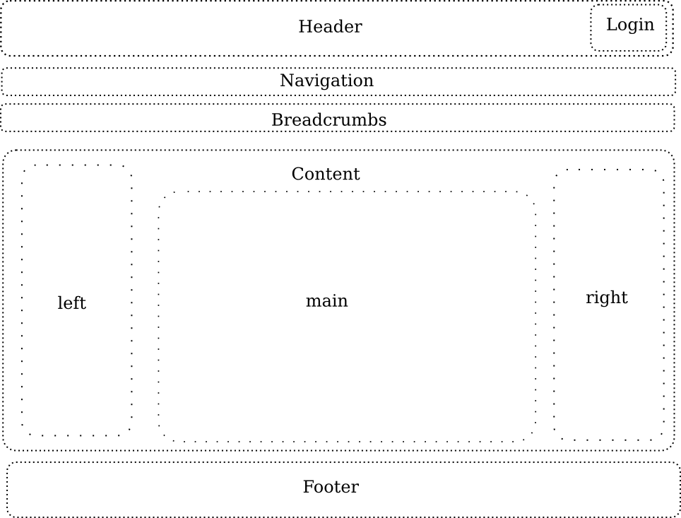

.. 

Web shop Design
===============

General
-------
The used company and all data are notional. There is no exisiting connection 
to any existing company with the same or similar name.

Company name
^^^^^^^^^^^^
The company name is: **Pencil AG**

Address
^^^^^^^
The complete address of the company is ::

    Pencil AG
    Musterstrasse 1
    3000 Bern
    Schweiz

Logo
^^^^
The logo used in this project is borrowed from the `Tango project`_ icon set.
The file is out of the `categories` section, the file name of the origin file
is ``applications-office.svg`` and is licensed under Public Domain.

.. image:: images/logo.png
    :align: center
    :alt: Pencil AG Logo

.. _Tango project: http://tango.freedesktop.org/

.. _layout:

Layout
------
The layout is splitted in different sections. The content of the elements, 
especially of the main section (content), will be definied by the later usage
of the page.

Sitemap
-------
The sitemap shows the clustering of the shop at the beginning of the project.

This doesn't mean that everything will be done. Static pages are easy to make
and to maintain.

Main page
---------
The first draft of the main page is based on the prototype shown in section
:ref:`layout`, without any format- und style informationen. ::

    <!DOCTYPE html>
    <html lang="en">
        <head>
            <meta charset="utf-8">
            <meta name="viewport" content="width=device-width, initial-scale=1.0">
            <meta name="description" content="Webshop Pencil AG für Bleistifte">
            <meta name="author" content="Fabian Affolter">
            <title>Webshop Pencil AG | Home</title>
        </head>

        <body>
            <!-- Header container-->
            

                

                  <!-- Logo and company name -->
                  
                  <h2>Webshop Pencil AG</h2>
                  <!-- Navigation -->
                  <ul>
                      <li><a href="#">Home</a></li>
                      <li><a href="#">Produkte</a></li>
                      <li><a href="#">Über uns</a></li>
                  </ul>
                  <!-- Breadcrumb -->
                  <ol>
                      <li><a href="#">Ebene 1</a></li>
                      <li><a href="#">Ebene 2</a></li>
                      <li><a href="#">Ebene 3</a></li>
                  </ol>
                

            

            <!-- Header container-->

            <!-- Action container -->
            

                <h1>Wochen-Aktion</h1>
                
Dies ist eine super Aktion. 10 Bleistifte für CHF 8.

            

            <!-- Action container -->

            <!-- Selected products -->
            

                
Hier hat es zufällige Produkte...

            

            <!-- Selected products -->

            <!-- Footer -->
            

                
&copy; Pencil AG 2013

            <!-- Footer -->
            

        </body>
    </html>

Loaded in a browser the initial draft of the main page looks like in the
following :ref:`screenshot <main1>`.

.. _main1:

.. image:: images/main1.png
    :width: 400px
    :align: center
    :alt: Screenshot of the page in Midori
